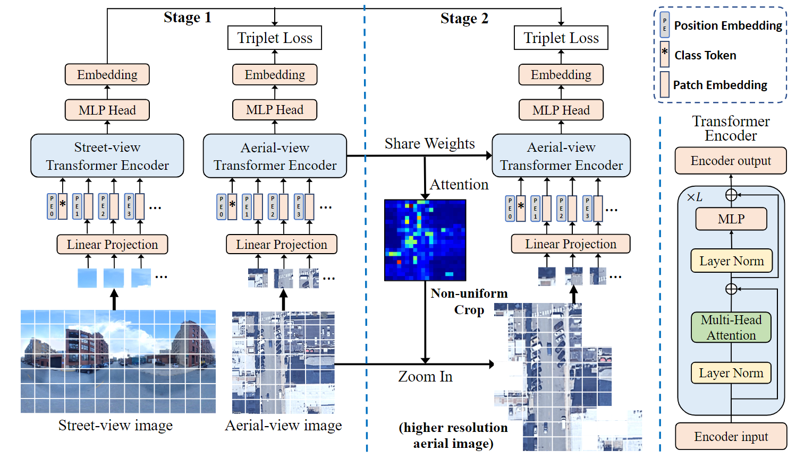

# TransGeo2022
This repository provides the code for "[TransGeo: Transformer Is All You Need for Cross-view Image Geo-localization](https://openaccess.thecvf.com/content/CVPR2022/html/Zhu_TransGeo_Transformer_Is_All_You_Need_for_Cross-View_Image_Geo-Localization_CVPR_2022_paper.html)".



```
@inproceedings{zhu2022transgeo,
  title={TransGeo: Transformer Is All You Need for Cross-view Image Geo-localization},
  author={Zhu, Sijie and Shah, Mubarak and Chen, Chen},
  booktitle={Proceedings of the IEEE/CVF Conference on Computer Vision and Pattern Recognition},
  pages={1162--1171},
  year={2022}
}
```

## Dataset
Please prepare [VIGOR](https://github.com/Jeff-Zilence/VIGOR), [CVUSA](http://mvrl.cs.uky.edu/datasets/cvusa/) or [CVACT](https://github.com/Liumouliu/OriCNN). You may need to modify specific path in dataloader.

## Requirement
	- Python >= 3.6, numpy, matplotlib, pillow, ptflops, timm
    - PyTorch >= 1.8.1, torchvision >= 0.11.1
	
## Training and Evaluation
Simply run the scripts like:

    sh run_CVUSA.sh

You may need to specify the GPUs for training in "train.py". Remove the second line if you want to train the simple stage-1 model. Change the "--dataset" to train on other datasets. The code follows the multiprocessing distributed training style from [PyTorch](https://github.com/pytorch/examples/tree/main/imagenet) and [Moco](https://github.com/facebookresearch/moco), but it only uses one GPU by default for training. You may need to tune the learning rate for multi-GPU training, e.g. [linear scaling rule](https://arxiv.org/pdf/1706.02677.pdf). There may be memory issue if training with too many GPUs with our sampler. 

We follow timm, ViT and [Deit](https://github.com/facebookresearch/deit) for pytorch implementation of vision transformer. We use the pytorch implementation of [ASAM](https://github.com/davda54/sam).

## Pretrained Models
You can find the pretrained models [here](https://drive.google.com/drive/folders/1oaITF_WJojkNaCMGTkBwNjOASEIEg6Vr?usp=sharing). Simply add "-e" for train.py if you want to evaluate with pretrained weights. Please refer to [VIGOR](https://github.com/Jeff-Zilence/VIGOR) for meter-level evaluation code. Validation features for VIGOR are also available for quick meter-level evaluation from npy. Let me know if there is anything wrong with the link.
    
## Reference
    - http://mvrl.cs.uky.edu/datasets/cvusa/
    - https://github.com/Jeff-Zilence/VIGOR
    - https://github.com/Liumouliu/OriCNN
    - https://github.com/facebookresearch/deit
    - https://github.com/facebookresearch/moco
    - https://github.com/davda54/sam
    - https://github.com/david-husx/crossview_localisation.git

